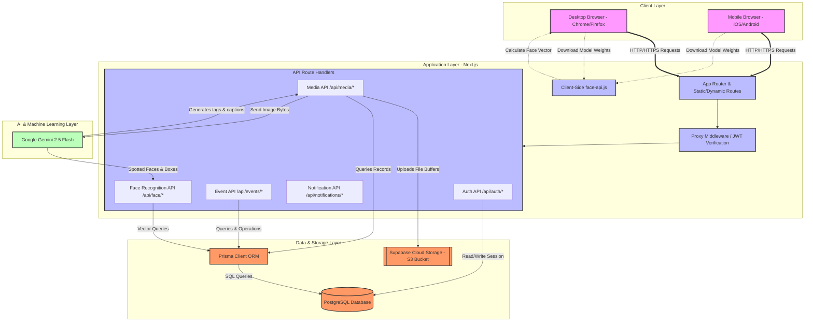

# CloudHub System Architecture

This document outlines the system architecture, component layout, and database layout of the **CloudHub** platform.

---

## System Architecture Diagram

The diagram below visualizes the client-server architecture, database integrations, cloud storage connections, and AI/ML services:

---

## Component Description

### 1. Client Layer (Frontend UI)
* **Next.js Single Page App (SPA)**: Styled using Tailwind CSS and Framer Motion for smooth visual micro-animations, premium transitions, and responsive mobile-first layouts.
* **Client-Side Face Detection**: Utilizes `@vladmandic/face-api` (SSD Mobilenet v1 & landmark models) to detect landmarks and generate 128-dimensional face vectors in the browser to offload heavy neural calculations.

### 2. Application Layer (Next.js API Routes)
* **API Handler**: Houses backend serverless functions that interact with the database via Prisma and external cloud services.
* **Authentication Middleware**: Inspects incoming requests, validates JWT cookies, and injects authenticated user headers (`x-user-id`, `x-user-role`, `x-user-club`) into backend requests.

### 3. Data & Storage Layer
* **PostgreSQL Database**: Relational database storing user records, hashed passwords, events, albums, media items (metadata, URLs, tags), likes, comments, favorites, and notifications.
* **Supabase Storage**: Cloud-based object storage for high-resolution images, videos, and avatars (S3-compatible, fast CDN delivery).
* **Prisma ORM**: Type-safe query engine mapping PostgreSQL tables to client objects.

### 4. AI & Machine Learning Layer
* **Google Gemini 2.5 Flash**: Multi-modal large language model used for:
  - **Smart Image Tagging**: Scanning image content and automatically labeling semantic tags (e.g. `technology`, `music`, `concert`, `gathering`).
  - **Social Captioning**: Generating social-media style captions dynamically.
  - **Facial Recognition**: Comparing uploaded photos against registered users' selfies to spot and automatically tag individuals.

---

## Security & Data Flow

### Media Access Control
1. When a client requests a media item, the API route handler validates the user's role and club membership.
2. For **Private Event Media**, access is restricted only to:
   - Platform Admins
   - Event Photographers
   - Club Members belonging to the organizing club.
3. For **Public Event Media**, all authenticated users are granted access.

### Watermark Download Flow
1. Client requests a download token or raw media bytes.
2. Server verifies access permissions and streams the media bytes.
3. Client-side canvas intercepts the image, loads it onto an invisible DOM canvas, and dynamically draws the watermark containing:
   - **Club Name** (bottom-left)
   - **Event Name** (bottom-left)
   - **User Role** (bottom-right)
   - **Tilted Overlay Text** (diagonal center)
4. Canvas converts the watermarked image back into a Blob and triggers the file save.
